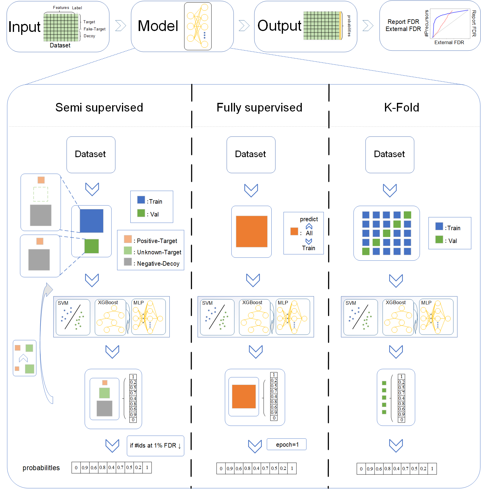
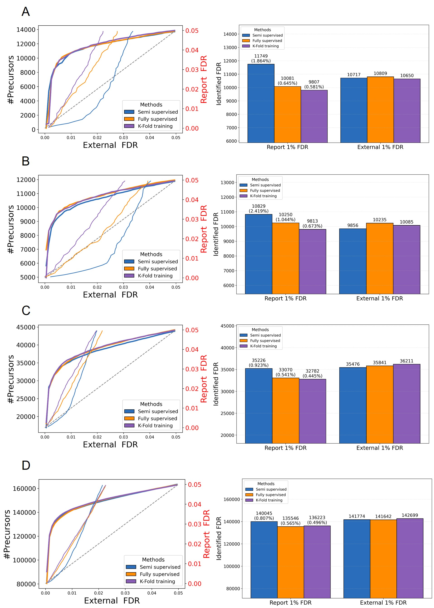
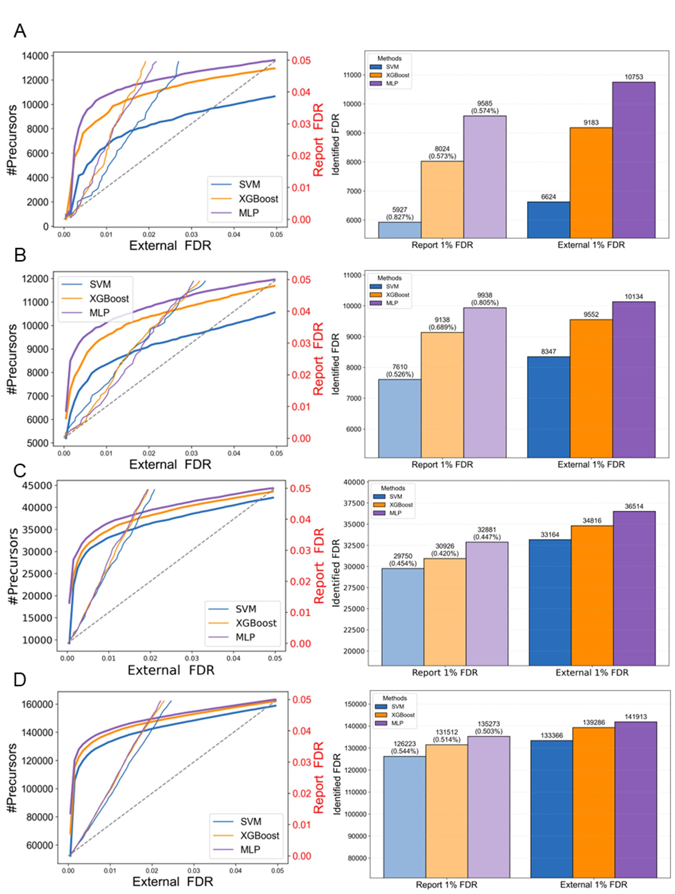

## Disc_Hub

### Overview

this study proposed representative DIA datasets and introduced Disc-Hub, a software package for evaluating machine learning performance. 

Disc-Hub enables users to flexibly combine training strategies and classifiers, facilitating rapid selection of appropriate machine learning configurations.   

The workflow diagram is below, providing an overview of the process.



## Installation

To use `Disc_Hub`,  make sure you have the following dependencies installed: 

​	● Python(>=3.12)

​	● numpy(>=2.1.3)

​	● matplotlib(>=3.10.1)

​	● pandas(>=2.2.3)

​	● pyarrow(==19.0.0)

​	● torch(>=2.6.0)

​	● xgboost(>=3.0.0)

​	● scikit-learn(>=1.5.2)

 You can install the `Disc_Hub` package using pip: 

```
pip install Disc_Hub_DIA
```


## Usage

 Here is an example of how to use `Disc_Hub` for DIA identification  : 

```python
import pandas as pd
from Disc_Hub_DIA import train_ensemble, plot_ids_and_fdr

if __name__ == '__main__':
    file_path = r"plasma_600ng_464.parquet"
    df = pd.read_parquet(file_path)
	
    # The framework hyperparameter options are "semi," "fully," and "kfold."
    # The discriminator hyperparameter options are "svm," "xgboost," and "mlp."
    df = train_ensemble(df=df, framework = 'kfold', discriminator = 'mlp')

    plot_ids_and_fdr(df,
    col_score='ensemble_prob',
    save_path=r"picture_disc_hub.png")
```


## Performance test






