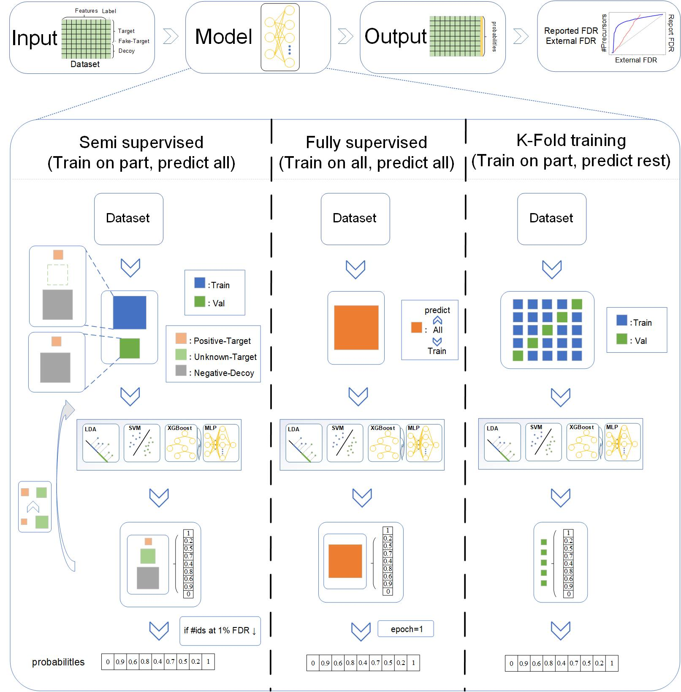
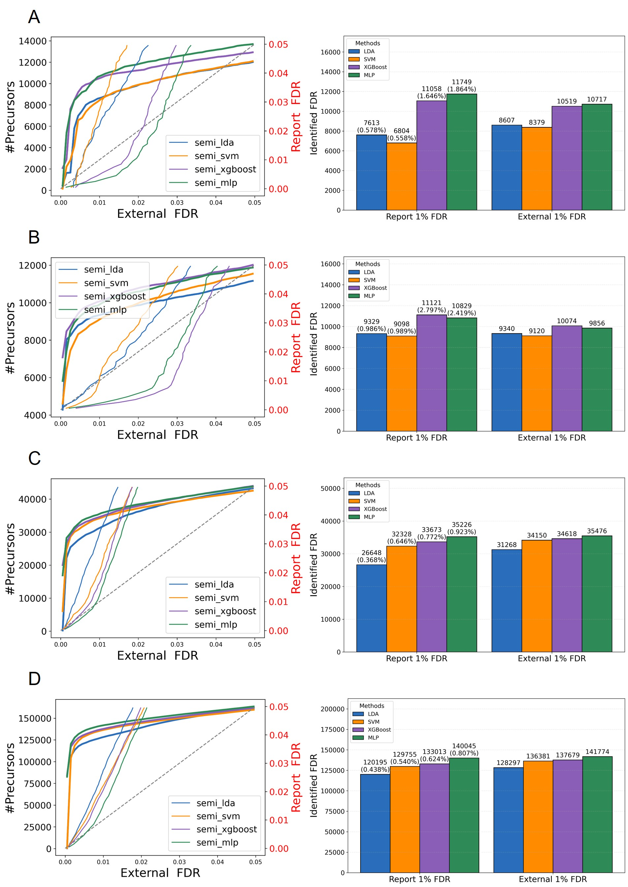

# Disc_Hub

## Overview

this study proposed representative DIA datasets and introduced Disc-Hub, a software package for evaluating machine learning performance. 

Disc-Hub enables users to flexibly combine training strategies and classifiers, facilitating rapid selection of appropriate machine learning configurations.   

The workflow diagram is below, providing an overview of the process.



## Installation

To use `Disc_Hub`,  make sure you have the following dependencies installed: 

​	● Python(>=3.12)

​	● numpy(>=2.1.3)

​	● matplotlib(>=3.10.1)

​	● pandas(>=2.2.3)

​	● pyarrow(==19.0.0)

​	● torch(>=2.6.0)

​	● xgboost(>=3.0.0)

​	● scikit-learn(>=1.5.2)

 You can install the `Disc_Hub` package using pip: 

```python
pip install Disc_Hub_DIA_FDR
```


## Usage

 To ensure that this tool can be used with different datasets, please make sure your dataset meets the following characteristics: 

```python
1.Each row represents a peptide ion;
2.Contains a 'decoy' column, where decoy=0 represents target samples and decoy=1 	
  represents decoy samples;
3.The column names of feature columns start with 'score_'.
```

Here is an example of how to use `Disc_Hub` for DIA identification  : 

```python
import pandas as pd
import warnings
from sklearn.exceptions import ConvergenceWarning
from Disc_Hub_DIA_FDR import train_ensemble, plot_ids_and_fdr


if __name__ == '__main__':
    warnings.filterwarnings("ignore", category=ConvergenceWarning)

    file_path = r"C:\Users\53458\Desktop\Dataset\SC_3116.parquet"
    df = pd.read_parquet(file_path)

    df = train_ensemble(df=df, framework = 'kfold', discriminator = 'mlp')
    # framework + '_' + discriminator
    plot_ids_and_fdr(df,
    col_score='kfold_mlp',
    save_path=r"picture_disc_hub.png")
```


## Performance test

1. Fix the learner as MLP and test the performance of three training frameworks.


2. Fix the training framework as K-fold and test the performance of four classifiers.


3. Fix the training framework as semi-supervised and test the performance of four classifiers.




4. Fix the training framework as fully supervised and test the performance of four classifiers.


## Dataset

​	You can find available datasets at the following websites：

​	https://figshare.com/articles/dataset/Disc_Hub/29163410

